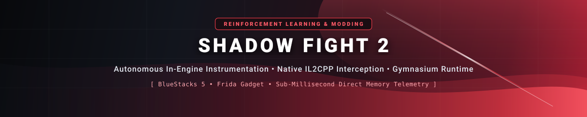
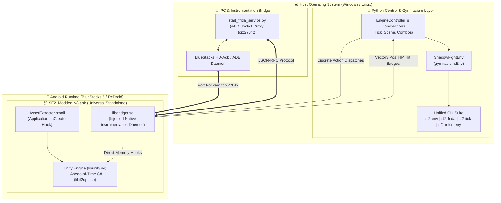

<!-- Header Banner with Dark Slate to Crimson Shadow Fight Gradient -->
<div align="center">
  
  <br/>
  
  <br/>
  <p align="center">
    
    
    
    
    
    
    
  </p>
  <a href="https://www.linkedin.com/in/ishan-shishodiya-5100061b9/"></a>
  &nbsp;
  <a href="mailto:sly.of.zero@gmail.com"></a>
  &nbsp;
  <a href="https://github.com/slyofzero"></a>
</div>

---

## 🎬 In-Action Demonstration

<p align="center">
  <video src="./assets/demo.mp4" controls width="88%" poster="./modding/assets/icons/cat_blasters_icon_512.png">
    <p><i>To play this demonstration, download or view <a href="./assets/demo.mp4"><code>./assets/demo.mp4</code></a> or record a live session using the automated harness.</i></p>
  </video>
</p>
<p align="center"><i>Demonstrating direct native IL2CPP action injection, zero-latency physics stepping, and live telemetry extraction.</i></p>

```text
┌── [SF2 RL Autonomous Agent Execution Session] ──────────────────────────────────────────────┐
│ [0.00s]  🔗 Handshake established with BlueStacks 5 via Frida Gadget (tcp:27042)           │
│ [0.12s]  🥊 Native IL2CPP Scene Queued: Combat Entered (Zone 1 - Lynx Tournament)          │
│ [0.28s]  ⏱️  Tick Controller: Master physics clock hijacked (Simulation Speed: 3.0x)        │
│ [0.35s]  📡 Telemetry Stream Active: HP [P1: 100.0% | P2: 100.0%] Distance Δ: 2.34m         │
│ [0.52s]  ⚡ Action Dispatched: [Direction: RIGHT_UP, Button: PUNCH] -> Heavy Spin Slash   │
│ [0.81s]  💥 Hit Badge: CRITICAL HEAD HIT! Enemy HP: 100.0% -> 76.5% (Reward: +1.52)        │
│ [1.14s]  🔄 Soft Episode Reset: HP rewritten in 8ms (Zero animation delay or menu reload) │
└─────────────────────────────────────────────────────────────────────────────────────────────┘
```

---

## 📑 Table of Contents

- [🎯 Aim \& Vision of the Project](#-aim--vision-of-the-project)
- [⚙️ Prerequisites \& Environment Setup](#️-prerequisites--environment-setup)
  - [1. BlueStacks 5 Emulator Setup](#1-bluestacks-5-emulator-setup)
  - [2. APK Selection \& Milestone Builds](#2-apk-selection--milestone-builds)
  - [3. Python Environment Setup](#3-python-environment-setup)
- [🎮 How to Interact with the Project](#-how-to-interact-with-the-project)
  - [⚡ Quick Start in 3 Commands](#-quick-start-in-3-commands)
  - [🖥️ High-Level CLI Command Suite](#️-high-level-cli-command-suite)
  - [🐍 Python RL Agent Training Loop](#-python-rl-agent-training-loop)
  - [🕹️ Low-Level Engine Controller REPL](#️-low-level-engine-controller-repl)
- [🗺️ System Architecture](#️-system-architecture)
- [🔬 Core Technical Innovations](#-core-technical-innovations)
- [📂 Repository Layout](#-repository-layout)
- [📚 Documentation Index](#-documentation-index)
- [🔭 Research Roadmap](#-research-roadmap)
- [👤 Author \& Research Statement](#-author--research-statement)

---

## 🎯 Aim & Vision of the Project

The ultimate goal of this project is to build an autonomous **Reinforcement Learning (RL)** agent capable of mastering *Shadow Fight 2* across diverse martial arts combat scenarios against varying AI opponents (Act 1 through Act 6 tournament fighters, bodyguards, and bosses).

Commercial mobile fighting games are notoriously hostile to reinforcement learning pipelines because they operate as closed black boxes:
* **No APIs or External Hooks**: Compiled ahead-of-time into native ARM machine code via Unity IL2CPP (`libil2cpp.so`) with obfuscated and encrypted class metadata.
* **Non-Deterministic Clocks & UI Delays**: Locked at 60 FPS real-time rendering with unskippable 15-second victory/defeat animations, stamina meters, and interstitial reward screens.
* **Perception Latency**: Traditional vision-only capture (screen parsing via OCR or CNNs) introduces frame drops, lag, and ambiguous state representations.

### The Solution: Complete In-Engine Transformation
This repository turns *Shadow Fight 2* into a high-performance **OpenAI Gymnasium (`gymnasium.Env`)** interface:

$$\text{Gym Interface}: \quad \text{step}(\mathbf{a}_t) \longrightarrow \left(\mathbf{s}_{t+1}, r_t, d_t, \text{info}\right)$$

1. **Deterministic Physics Stepping**: Replaces the real-time game clock with a discrete tick controller capable of pausing physics, stepping $N$ frames at a time, or accelerating simulation up to $10\times$ speed.
2. **Sub-Millisecond Direct Memory Telemetry**: Extracts true 3D spatial coordinates, animation hashes, floating-point health values, and combat badge events directly from Unity memory via dynamic binary instrumentation.
3. **Instant Episode Soft-Resets**: Resets matches in **< 10ms** by rewriting character health pointers directly in memory, bypassing game over menus and cutscenes entirely.
4. **Automated Reverse Engineering & Modding**: Bypasses save validation checksums, pre-bundles 13+ MB of offline DLC packages, eliminates video intros, and embeds runtime debugging daemons directly inside signed, monolithic APKs.

---

## ⚙️ Prerequisites & Environment Setup

### 1. BlueStacks 5 Emulator Setup

1. **Download & Install**: Install [BlueStacks 5 (64-bit Pie or Android 11)](https://www.bluestacks.com/).
2. **Enable Android Debug Bridge (ADB)**:
   * Open BlueStacks → **Settings** (gear icon) → **Advanced**.
   * Toggle **Android Debug Bridge** to **ON**.
   * Verify the default ADB port (usually `127.0.0.1:5037` or `127.0.0.1:5555`).
3. **Port Forwarding for Frida Gadget**:
   Run the following in PowerShell to forward the embedded Gadget listener:
   ```powershell
   & "C:\Program Files\BlueStacks_nxt\HD-Adb.exe" forward tcp:27042 tcp:27042
   ```

### 2. APK Selection & Milestone Builds

> [!IMPORTANT]
> **APK Immutability Rule**: Milestone builds in [`bluestacks/apks/`](bluestacks/apks/) are permanently preserved and immutable. **Use `SF2_Modded_v8.apk` for all current RL training and CLI interactions.**

| APK Target | Build Size | Features & Status |
| :--- | :--- | :--- |
| `SF2_OG.apk` | 162.75 MB | 🔒 **Untampered Baseline** — Clean upstream release (v2.46.0). |
| `SF2_Modded_v1.apk` | 333.23 MB | Monolithic merged standalone build with Cyan Dojo textures. |
| `SF2_Modded_v2.apk` | 333.23 MB | Cold boot directly into Act 1 Tournament map. |
| `SF2_Modded_v3.apk` | 333.20 MB | Infinite VIP Energy patch + unskippable cinematic bypass. |
| `SF2_Modded_v4.apk` | 333.23 MB | Configurable arbitrary round control ($N$ rounds per match). |
| `SF2_Modded_v5.apk` | 333.23 MB | Native Dojo sparring restoration build. |
| `SF2_Modded_v6.apk` | 333.23 MB | Act 1 map cold boot + Dojo menu restoration. |
| `SF2_Modded_v7.apk` | 342.91 MB | Embedded Frida Gadget milestone build. |
| `SF2_Modded_v8.apk` | 342.90 MB | 🚀 **Production RL Target** — Unconditional Frida Gadget on boot. |

#### Automated APK Installation Helper:
Install the target APK into your active BlueStacks instance with one command:
```powershell
# Installs SF2_Modded_v8.apk automatically via ADB
.\bluestacks\scripts\install_apk.ps1 -Target v8
```

### 3. Python Environment Setup

The repository uses [`uv`](https://github.com/astral-sh/uv) for fast, isolated dependency management:

```powershell
# 1. Create an isolated Python 3.12 virtual environment
uv venv .venv

# 2. Activate the environment (Windows PowerShell)
.venv\Scripts\Activate.ps1

# 3. Install project and CLI entrypoints in editable mode
uv pip install -e .
```

---

## 🎮 How to Interact with the Project

### ⚡ Quick Start in 3 Commands

```powershell
# Step 1: Install the latest production APK into BlueStacks
.\bluestacks\scripts\install_apk.ps1 -Target v8

# Step 2: Establish the Frida instrumentation bridge
sf2-frida

# Step 3: Open the interactive RL REPL environment
sf2-env interactive
```

---

### 🖥️ High-Level CLI Command Suite

The repository registers first-class CLI entrypoints defined in [`pyproject.toml`](pyproject.toml):

#### 🕹️ `sf2-env` — Gymnasium Interactive REPL & Environment Control
High-level environment lifecycle, physics stepping, and interactive combat:
```powershell
sf2-env interactive          # Drop into interactive REPL console
sf2-env start                # Start a combat round
sf2-env step 10              # Advance physics by 10 discrete ticks
sf2-env speed 5.0            # Accelerate simulation to 5.0x speed
sf2-env state                # Dump full JSON telemetry snapshot
sf2-env reset                # Instantly soft-reset episode (<10ms)
```

#### 🪝 `sf2-frida` — Connection & Instrumentation Daemon
Port forwarding and Frida Gadget connection manager:
```powershell
sf2-frida                    # Start Frida bridge + port forward (one-shot)
sf2-frida --watch            # Continuous watchdog monitor (auto-reconnect)
sf2-frida --status           # Verify Gadget connection status
```

#### ⏱️ `sf2-tick` — Master Physics Timing Controller
Low-level time dilation and deterministic freeze-frame controller:
```powershell
sf2-tick freeze              # Freeze the in-game physics clock
sf2-tick step                # Step exactly one physics frame
sf2-tick unfreeze            # Restore real-time simulation
sf2-tick speed 3.0           # Run physics simulation at 3.0x speed
```

#### 📡 `sf2-telemetry` — Live Telemetry & Badge Streamer
High-speed memory reflection for positions, HP, moves, and hits:
```powershell
sf2-telemetry --pretty       # Print formatted snapshot of game state
sf2-telemetry --pretty --live# Stream real-time events as NDJSON
sf2-telemetry --badges       # Stream combat hit badges only
```

---

### 🐍 Python RL Agent Training Loop

Using the standard **OpenAI Gymnasium** interface:

```python
import gymnasium as gym
from rl_env import ShadowFightEnv

# Initialize the environment (connects to Frida Gadget & BlueStacks)
env = ShadowFightEnv()
obs, info = env.reset()

print(f"Initial State | Player HP: {info['player_hp']:.1f} | Enemy HP: {info['enemy_hp']:.1f}")

for step in range(500):
    # Sample action: [direction (0-8), attack_button (0-2)]
    action = env.action_space.sample()

    # Step environment: executes discrete physics step
    obs, reward, terminated, truncated, info = env.step(action)

    if step % 25 == 0:
        print(f"Step {step:03d} | Reward: {reward:+.2f} | P1 HP: {info['player_hp']:.1f}% | P2 HP: {info['enemy_hp']:.1f}%")

    if terminated or truncated:
        print("Episode finished. Performing instant soft-reset...")
        obs, info = env.reset()

env.close()
```

#### Action & Observation Spaces:

| Space | Type | Dimensions / Range | Description |
| :--- | :--- | :--- | :--- |
| **Action Space** | `MultiDiscrete([9, 3])` | $9 \times 3 = 27$ combos | Directional input (`NEUTRAL`, `UP`, `DOWN`, `FORWARD`, etc.) $\times$ Combat button (`NONE`, `PUNCH`, `KICK`). |
| **Observation Space** | `Dict` / `Box` | Normalized $\mathbb{R}^N$ | Vector3 player/enemy coordinates, HP percentages ($[0.0, 1.0]$), animation state hashes, and active attack frame counters. |
| **Reward Function** | Scalar | $\Delta \text{HP}_{\text{enemy}} - \Delta \text{HP}_{\text{player}} + R_{\text{head}} - \lambda_{\text{time}}$ | Dense damage delta rewarded with head-hit and critical strike bonuses. |

---

### 🕹️ Low-Level Engine Controller REPL

For low-level combat research, debugging move combinations, or verifying animation cancels:

```powershell
# Launch the native IL2CPP action controller REPL
.venv\Scripts\python.exe scripts/engine_controller.py
```
* **Supported Commands**: `punch`, `kick`, `f_punch`, `b_kick`, `jump_kick`, `sweep`, `freeze`, `step`, `hp`, `coords`.

---

## 🗺️ System Architecture



---

## 🔬 Core Technical Innovations

<table>
  <tr>
    <td width="50%" valign="top">
      <h4>⚙️ Modding & Reverse Engineering</h4>
      <ul>
        <li><b>Smali Startup Hook (<code>AssetExtractor.smali</code>)</b>: Intercepts Android's <code>Application.onCreate()</code> to auto-provision 13.12 MB of game bundles and completed saves on first boot.</li>
        <li><b>ARM64 Binary Patching</b>: Neutralizes save checksum checks (<code>mov w0, #1; ret</code>) and bypasses CDN download gates directly in <code>libil2cpp.so</code>.</li>
        <li><b>Exact-Byte Package Rebranding</b>: Preserves binary compatibility with <code>global-metadata.dat</code> while renaming package to <code>com.nekki.catblasters</code>.</li>
      </ul>
    </td>
    <td width="50%" valign="top">
      <h4>⚡ Frida Gadget & RL Runtime</h4>
      <ul>
        <li><b>Embedded Frida Gadget</b>: Injected directly into the APK's <code>lib/arm64-v8a/</code> and loaded automatically on startup, enabling rootless dynamic instrumentation.</li>
        <li><b>Physics Tick Hijacking</b>: Hooks Unity's native update loop to pause and step physics deterministically without UI rendering artifacts.</li>
        <li><b>Sub-Millisecond Telemetry</b>: Real-time pointer chasing extracts player positions, weapon states, and health points in < 1ms.</li>
      </ul>
    </td>
  </tr>
</table>

---

## 📂 Repository Layout

```text
Shadow Fight 2/
├── .agents/                           # Agent configuration, rules & reusable skills
│   ├── AGENTS.md                      # Master architecture guide & 64+ experiment log
│   └── skills/                        # Modular reversing, patching, & harness skills
├── scripts/                           # Core RL & Engine Automation Harness
│   ├── start_frida_service.py         # Frida bridge & ADB port-forward manager
│   ├── engine_controller.py           # Native IL2CPP action controller
│   ├── game_actions.py                # In-engine combat flow controller (Start, Pause, Exit)
│   ├── tick_controller.py             # Master timing controller (Freeze, Step, Speed)
│   ├── stream_telemetry.py            # Live NDJSON telemetry streamer
│   └── frida/                         # Standalone JavaScript hooks loaded by Python
│       ├── engine_harness.js          # Action dispatch & physics tick hook
│       ├── game_actions.js            # Main-thread scene update queue hook
│       ├── telemetry_streamer.js      # HP, 3D Vector3 positions, & hit badge streamer
│       └── tick_controller.js         # Physics tick freeze, speed, & step hook
├── rl_env/                            # Gymnasium Environment Package
│   ├── shadow_fight_env.py            # High-level Gymnasium environment class & REPL
│   ├── test_env.py                    # Verification test suite
│   ├── __init__.py                    # Package exports (ShadowFightEnv, SF2Env)
│   └── __main__.py                    # CLI entrypoint (python -m rl_env)
├── bluestacks/                        # BlueStacks Runtime & Pre-Built APKs
│   ├── apks/                          # Immutable versioned APK milestone builds
│   │   ├── SF2_OG.apk                 # Untampered baseline APK
│   │   ├── SF2_Modded_v8.apk          # Production build with embedded Frida Gadget
│   │   └── ...                        # Historical versioned milestones (v1–v7)
│   ├── configs/                       # BlueStacks keymapper configurations (.cfg)
│   └── scripts/install_apk.ps1        # Automated ADB installation script
├── modding/                           # Asset Reversing & APK Build Pipeline
│   ├── pipeline/                      # Build automation (patcher, signer, downloader)
│   ├── assets/                        # Textures, saves, smali hooks, and offline bundles
│   ├── docs/                          # In-depth technical guides (01 through 10)
│   └── tools/                         # apktool, uber-apk-signer, Il2CppDumper
├── pyproject.toml                     # PEP 517/621 package config & CLI entrypoints
├── Makefile / make.bat                # Cross-platform command wrappers
└── .venv/                             # Isolated Python 3.12 virtual environment (uv)
```

---

## 📚 Documentation Index

For deep-dive architectural specifications, reverse engineering documentation, and disassembly logs, consult [`modding/docs/`](modding/docs/):

* [**01. Architecture Overview**](modding/docs/01_ARCHITECTURE_OVERVIEW.md) — Unity IL2CPP game engine structure, runtime layout, and class hierarchy.
* [**02. Textures & Graphics**](modding/docs/02_TEXTURES_AND_GRAPHICS.md) — Unity asset serialization and texture replacement via UnityPy.
* [**03. IL2CPP & Binary Patching**](modding/docs/03_IL2CPP_AND_BINARY_PATCHING.md) — Disassembly analysis and ARM64 instruction patching.
* [**04. Save Profiles & Progression**](modding/docs/04_SAVE_PROFILES_AND_PROGRESSION.md) — Save XML schema, encryption hashing, and instant progression unlock.
* [**05. Offline Bundles & CDN**](modding/docs/05_OFFLINE_BUNDLES_AND_CDN.md) — Automated game asset downloader and bundle packing.
* [**06. Startup Smali Hook**](modding/docs/06_STARTUP_SMALI_HOOK.md) — Smali bytecode injection into `Application.onCreate()`.
* [**07. Build & Signing Pipeline**](modding/docs/07_BUILD_AND_SIGNING_PIPELINE.md) — Monolithic APK repacking, zipalign, and v1/v2/v3 signing.
* [**08. Engine Controller & RL Harness**](modding/docs/08_ENGINE_CONTROLLER_AND_RL_HARNESS.md) — In-engine Frida hook architecture and direct memory dispatch.
* [**09. Headless & Containerized Runtimes**](modding/docs/09_HEADLESS_AND_CONTAINERIZED_RUNTIMES.md) — ReDroid and headless Linux container setups.
* [**10. Fighter Roster & Arena Catalog**](modding/docs/10_ROSTER_AND_ARENAS_CATALOG.md) — Comprehensive enemy and arena identifier reference.

---

## 🔭 Research Roadmap

- [x] **Milestone 1 — Reverse Engineering & Standalone Build**: Decompile IL2CPP, map memory offsets, eliminate DLC download barriers, and sign standalone monolithic APKs.
- [x] **Milestone 2 — In-Engine Hooking**: Embed Frida Gadget directly in the APK package and implement low-level tick and scene controllers.
- [x] **Milestone 3 — Gymnasium Environment**: Implement `ShadowFightEnv` with action dispatch, sub-millisecond telemetry extraction, and instant soft-reset.
- [ ] **Milestone 4 — Visual Observation & Frame Stacking**: Incorporate high-throughput frame grabbing via DXcam / raw memory framebuffers.
- [ ] **Milestone 5 — PPO / SAC Training Pipeline**: Train baseline autonomous fighting agents using Stable-Baselines3 and track policies with Weights & Biases.
- [ ] **Milestone 6 — Multi-Fighter Curriculum**: Automated curriculum learning progressing from sparring dummies to Act 6 Bosses (Lynx, Hermit, Butcher, Wasp, Widow, Shogun).
- [ ] **Milestone 7 — Cloud & Headless Cluster**: Scaled multi-instance training using ReDroid inside Docker containers.

---

## 👤 Author & Research Statement

**Ishan Shishodiya** — Systems Engineer $\rightarrow$ AI Research Engineer  
Specializing in systems programming, native reverse engineering, and reinforcement learning.

* 🌐 **LinkedIn**: [linkedin.com/in/ishan-shishodiya-5100061b9](https://www.linkedin.com/in/ishan-shishodiya-5100061b9/)
* 📧 **Email**: [sly.of.zero@gmail.com](mailto:sly.of.zero@gmail.com)
* 🐙 **GitHub**: [@slyofzero](https://github.com/slyofzero)

<p align="center">
  <i>"Transforming closed interactive systems into open, deterministic environments for machine intelligence."</i>
</p>
